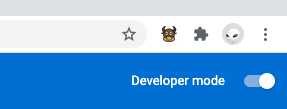
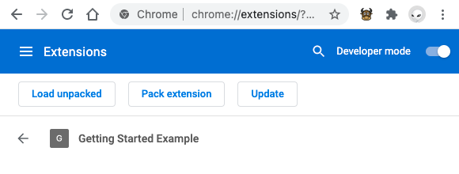
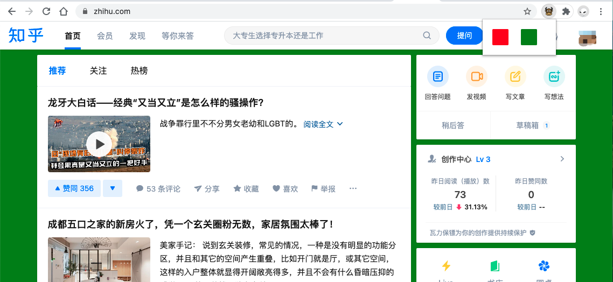

# chrome extensions v3 教程

> 最近接了一个私活儿，需要开发一个浏览器插件，功能还挺复杂。但是查了一圈资料后发现可用度很低，要么过时并且示例不可运行，要么逻辑不清抓不住重点。我有一个观点，能交给别人的知识和技能才是自己的，那我就写一个教程吧。(动笔时间 2020.03.10)

## 概述

由于中文资料有滞后性，我们直接参考官方的英文原版文档。

[https://developer.chrome.com/docs/extensions/mv3/](https://developer.chrome.com/docs/extensions/mv3/)

对重要部分做翻译，对不足的地方做补充和说明。这是一个重在掌握基础的教程，后面我会把私活儿的代码做开源，另附一篇实战教程。

这趴教程的下面部分大体框架直接和官网对应。

## Welcome

这里为想要开发浏览器扩展的开发者提供一些指导和信息参考。

如果你还不确定要不要用浏览器扩展，可以看看这些页面:

- [什么是浏览器扩展?](https://developer.chrome.com/extensions/mv3/overview/) 帮助你明白浏览器扩展是什么
- [入门指导](https://developer.chrome.com/docs/extensions/mv3/getstarted/) 教你写一个 hello word

当然，如果你想要了解一些实用的切入点，，可以看看这些页面:

- 学习作用域相关内容 [chrome extensions 开发概览](https://developer.chrome.com/docs/extensions/mv3/devguide/)
- [示例](https://developer.chrome.com/docs/extensions/???/)，安装它，盘它
- [官方问答专区](https://developer.chrome.com/docs/extensions/mv3/faq/)，查找一些问题的好地方
- [Stack Overflow 中的 chrome extensions tag](https://stackoverflow.com/tags/google-chrome-extension/info)

## Getting started

一个 Chrome Extensions Manifest V3 包含 background scripts、content scripts,、an options page、UI elements 四部分内容(如果插件够简单有些部分可省略)。

编写一个 Chrome Extensions Manifest V3 从定义 manifest.json 文件开始，它是入口文件，类似于 npm 包的 package.json。

最简单的 manifest.json 是这样的:

```json
{
  "name": "Getting Started Example",
  "description": "Build an Extension!",
  "version": "1.0",
  "manifest_version": 3
}
```

我们新建个文件夹来存放上面 json，再找一个 png 图标(今年是牛年，我找了一个牛的图标)，配置图标引入:

```json
{
  "name": "Getting Started Example",
  "description": "Build an Extension!",
  "version": "1.0",
  "manifest_version": 3,
  "action": {
    "default_icon": "niu.png"
  }
}
```

首先打开 Chrome，More Tools / Extensions / 打开 Developer mode / Load unpacked

把我们刚才新建文件夹选一下。然后一个插件像模像样的出现在了浏览器右上角。



### 基础 Demo

到目前，我们的插件除了摆摆样子还什么都做不了。那是因为我们还没有告诉它要在什么时候做什么事情。

先加一个 service_worker:

```json
{
  "background": {
    "service_worker": "background.js"
  },
  "permissions": ["storage"]
}
```

background.js:
```js
let color = '#3aa757';

chrome.runtime.onInstalled.addListener(() => {
  chrome.storage.sync.set({ color });
  console.log('Default background color set to %cgreen', `color: ${color}`);
});
```

这个 js 是运行在后台的，不会对页面发生改变。在插件第一次安装或者插件更新版本时触发，保存一个键值为 color 的数据到 chrome.storage。先把数据存下来，后面介绍怎么用。

然后加一个页面的配置:

```json
{
  "action": {
    "default_popup": "popup.html"
  }
}
```

popup.html:
```html
<!DOCTYPE html>
<html>

<head>
  <meta charset="UTF-8">
  <link rel="stylesheet" href="button.css">
</head>

<body>
  <button id="changeColor">
    改变文本区背景色
  </button>
  <div id="text-container">
    内容区域
  </div>
  <script src="popup.js"></script>
</body>

</html>
```

button.css:
```css
body {
    width: 123px;
}
button {
    cursor: pointer;
}
#text-container {
    padding: 10px;
    margin: 10px 0;
}
```

popup.js
```js
let changeColor = document.getElementById("changeColor");
let backgroundColor;

chrome.storage.sync.get("color", ({
    color
}) => {
    backgroundColor = color;
});

changeColor.addEventListener("click", async () => {
    document.getElementById('text-container').style.backgroundColor = backgroundColor;
});
```

完整代码在 demo-code-1 中，这些代码就可与有这么一个界面:


点击按钮后文字区的背景颜色会改变。

这个 Demo 主要展示了这样几项功能:
- 初始化一个 Chrome Extensions；
- 图标的设定；
- 点击 Chrome Extensions 时展示一个小页面；
- 后台程序的初始化与相关事件；
- chrome.storage 的操作；
- 页面与后台的数据交互。

写程序少不了调试，下面介绍怎么调试我们的代码。

### 关于调试

在 Chrome 的地址栏输入 chrome://extensions/ 并打开后，就是 Extensions 列表了。将 Developer mode 开关打开后可用 Load unpacked 按钮上传 Extension 源码，然后点击我们上传插件的 Details 到插件详情页。后面我们每次修改代码刷新这个页面就可以了，当然也可以手动点击 Update 来更新。如果只是 popup 的修改，是可以直接更新的。



右击 Extension 图标 Inspect Popup 可以调试 popup，非常方便，与开发 pc 网站没有太大差别:


在 Extension 详情页点击 service worker 可以调试 background.js。


当前这个 Demo 的 background.js 中只包含了一个插件安装时触发的事件，并不容易调试到。下面我们再写一个功能更多一点的 Demo。

### 进阶 Demo

我们来写一个真正的浏览器插件，其功能是改变当前网页的背景色(用项目网站试了一下操作表单也是可以的)，核心代码在 demo-code-2/popup.js 中:

```js
const redBtn = document.getElementById("redBtn");

redBtn.addEventListener("click", async () => {
    let [tab] = await chrome.tabs.query({
        active: true,
        currentWindow: true
    });

    chrome.scripting.executeScript({
        target: {
            tabId: tab.id
        },
        function() {
            document.body.style.backgroundColor = 'red';
            // 如果页面中有单选按钮，可以用下面的代码控制其选中
            const doms = document.getElementsByClassName('el-radio__original');
            for (let i = 0; i < doms.length; i++) {
                const item = doms[i];
                if (item.value === 'female') {
                    item.checked = true;
                }
                else if (item.value === 'male') {
                    item.checked = false;
                }
            }
        },
    });
});
```

使用效果是这样的:



## 介绍 V3

Chrome Extensions Manifest V3 适用于 Chrome 88 及以上的 chrome。

注: 以下 Chrome Extensions Manifest V3 简称为 MV3。

MV3 当前最新版发布于 2021.01.19。

Chrome Extensions 是 Chrome 强大的组成部分，每天都有数以百万级的插件被下载。嗯，总之“很牛”就完了。

浏览器插件可以获得用户的更多授权，从而提供更强大的功能为用户服务。

### Service workers

MV3 将原来的 background pages 替换为了 service workers。

service workers 是一个服务器与浏览器之间的中间人角色，如果网站中注册了 service worker 那么它可以拦截当前网站所有的请求，进行判断（需要编写相应的判断程序），如果需要向服务器发起请求的就转给服务器，如果可以直接使用缓存的就直接返回缓存不再转给服务器。从而大大提高浏览体验。

Service worker 运行在 worker 上下文，不能访问DOM。

## 概览(Overview)

什么是 Extensions？

它是一个跑在 Chrome 浏览器中的一个应用，可以整合第三方网站或服务，并自定义浏览器行为。

开发的主要语言为 JavaScript，部分采用 html、css、图片等。

每个 Extension 必须要有一个 single purpose。

## API

当成工具查阅的 API 手册: https://developer.chrome.com/docs/extensions/reference/

## 样例(Samples)

这里是一个 github 仓库，汇集了一些样例。如果在这里能找到类似的样例，直接拿下来改改就能有一个自己的 chrome extension 了。

吐槽一下，这里的文档写的奇烂。与代码不符的，链接无效的，看这部分文档就像从一堆烂苹果中找一个完整的。

## 开发扩展组件和主题(Develop extensions and themes)

### 概览(overwiew)

提供不同应用场景的入口汇总。

- user interface，浏览器的用户界面修改，可以为浏览器添加自定义按钮，管理书签，快捷键等；
- Build extension utilities，扩展通用功能，如 OAuth2 access tokens 等；
- Modify and observe the Chrome Browser，修改于监听浏览器行为，如下载、代理、主题等；
- Modify and observe the web，修改与监听网页，可以监听激活状态的网页，并对网页做修改和自定义触发，广告屏蔽插件和对第三方网站做一些重复工作的自动化可用此块内容来实现；
- Package, deploy and update，打包、发布、更新 extension；
- Expand Chrome DevTools，扩展开发工具。

### manifest.json配置全集(Manifest file format)

这里有一份全量的 manifest.json 字段配置文件。

```json
{
  // Required
  "manifest_version": 3,
  "name": "My Extension",
  "version": "versionString",

  // Recommended
  "action": {...},
  "default_locale": "en",
  "description": "A plain text description",
  "icons": {...},

  // Optional
  "action": ...,
  "author": ...,
  "automation": ...,
  "background": {
    // Required
    "service_worker":
  },
  "chrome_settings_overrides": {...},
  "chrome_url_overrides": {...},
  "commands": {...},
  "content_capabilities": ...,
  "content_scripts": [{...}],
  "content_security_policy": "policyString",
  "converted_from_user_script": ...,
  "current_locale": ...,
  "declarative_net_request": ...,
  "devtools_page": "devtools.html",
  "differential_fingerprint": ...,
  "event_rules": [{...}],
  "externally_connectable": {
    "matches": ["*://*.example.com/*"]
  },
  "file_browser_handlers": [...],
  "file_system_provider_capabilities": {
    "configurable": true,
    "multiple_mounts": true,
    "source": "network"
  },
  "homepage_url": "http://path/to/homepage",
  "host_permissions": [...],
  "import": [{"id": "aaaaaaaaaaaaaaaaaaaaaaaaaaaaaaaa"}],
  "incognito": "spanning, split, or not_allowed",
  "input_components": ...,
  "key": "publicKey",
  "minimum_chrome_version": "versionString",
  "nacl_modules": [...],
  "natively_connectable": ...,
  "oauth2": ...,
  "offline_enabled": true,
  "omnibox": {
    "keyword": "aString"
  },
  "optional_permissions": ["tabs"],
  "options_page": "options.html",
  "options_ui": {
    "chrome_style": true,
    "page": "options.html"
  },
  "permissions": ["tabs"],
  "platforms": ...,
  "replacement_web_app": ...,
  "requirements": {...},
  "sandbox": [...],
  "short_name": "Short Name",
  "storage": {
    "managed_schema": "schema.json"
  },
  "system_indicator": ...,
  "tts_engine": {...},
  "update_url": "http://path/to/updateInfo.xml",
  "version_name": "aString",
  "web_accessible_resources": [...]
}
```

### Architecture overview 结构概览
