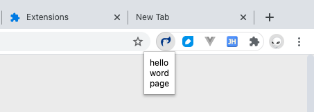

# chrome 扩展

> 实录一个 chrome 扩展的开发。

## 概述

需求是这样:

- 1、一个业务网站，内包含一批账号和密码；
- 2、在某个页面，选中一些账号和密码；
- 3、去一个政府网站上用这些账号和密码登录；
- 4、然后按指定路径点击并获取页面上的数据返回给业务网站。

做了一圈技术方案调研，初步锁定用 chrome 扩展来实现。我会把自己实际开发的过程记录下来，之前也没做过，基本算是从零开始。

开搞！！

## 写一个 hello word

新建个文件夹，按照教程写个 json。

```json
{
    "manifest_version": 3,
  
    "name": "E-xiaoqiangzhao",
    "description": "小强赵开发的chrome扩展",
    "version": "1.0",
    "permissions": [
      "https://www.baidu.com/"
    ],
    "action": {
      "default_icon": "icon.png",
      "default_popup": "popup.html"
    }
}
```

再配个 popup.html
```html
<!DOCTYPE html>
<html>
<head lang="zh-cn">
    <meta charset="UTF-8">
    <title>hello word page</title>
</head>
<body>

    hello word page
    
</body>
</html>
```

再找个图片做图标，完事。

## 放到浏览器中跑起来

首先打开浏览器，More Tools / Extensions / 打开 Developer mode / Load unpacked

选择文件夹，把我们刚才新建文件夹选一下。然后一个插件像模像样的出现在了浏览器右上角。


点击之后我们写的页面就出现了，是不是有点小兴奋。



随便写点东西看看插件能不能更新，这样开发调试的环境也就好了。其实 manifest_version 为 3 的扩展已经做到了热更新，不需要刷新了。

## 十字路口

写到这里真正的技术挑战来了，有一点无从下手的感觉，怎么办？

看文档。

为了快速了解，我们看参考资料中的第二份文档 “[一份不错的翻译文档](https://crxdoc-zh.appspot.com/extensions/getstarted)”。

你会发现这份文档有些过时了，示例文件已经找不到了。无奈只能和第一份英文文档“[官方文档-英文](https://developer.chrome.com/docs/extensions/mv3/)”相互参照着看了。

## 核心概念梳理

### 清单文件 manifest.json

相当于一个 npm 包的 package.json，插件的定义文件。

插件的图标，入口，界面等都在这个文件中定义。

### 架构

许多扩展程序有一个后台网页，它是一个包含扩展程序主要逻辑的不可见页面。扩展程序也可以包含其他页面，展现扩展程序的用户界面。如果扩展程序需要与用户加载的网页交互（相对于包含在扩展程序中的页面），扩展程序必须使用内容脚本。

### 后台网页 background.html

后台网页分两种：持续运行的后台网页与事件页面。

持续运行的后台网页保持打开状态，事件页面根据需要打开与关闭。

### 用户界面网页 popup.html

扩展程序可以包含普通的 HTML 网页，用来显示扩展程序的用户界面。

可以使用 tabs.create 或 window.open() 来显示扩展程序中的任何其他 HTML 文件。

### 内容脚本 contentscript.js

如果您的扩展程序需要与网页交互，您就需要使用内容脚本。内容脚本是一些 JavaScript 代码，它们在浏览器中已加载页面的上下文中执行。

内容脚本可以读取浏览器访问的网页的细节，并且可以修改页面。

### chrome.* API

扩展程序除了能够使用网页和应用的所有 API 外，还能使用仅用于 Chrome 浏览器的 API。

例如，任何扩展程序或网上应用可以使用标准的 window.open() 方法来打开一个网页，但是如果您想指定网页应该显示在哪个窗口中，您的扩展程序就可以使用仅用于 Chrome 浏览器的 tabs.create 方法。

大部分 chrome API 的方法都是异步的，它们不等待操作完成就立即返回。如果您需要知道操作结果，您可以向方法传递一个回调函数，回调函数将稍后在方法返回后的某个时刻执行（可能很久之后）。

也有一些 chrome.* 方法是同步的。同步的方法没有回调参数，因为它们只有当所有操作完成后才返回。通常，同步方法有返回值类型。

```js
string chrome.runtime.getURL();
```

### 页面间的通信

扩展程序中的 HTML 网页通常需要通信。因为一个扩展程序的所有网页在同一个进程中的同一个线程上执行，网页之间可以直接调用函数。

要获得扩展程序中的网页，请使用 chrome.extension 方法，例如 extension.getViews 和 extension.getBackgroundPage。一旦一个网页引用了扩展程序中的其他网页，第一个网页可以执行其他网页上的函数，并且可以操纵它们的 DOM。

### 保存数据

扩展程序可以使用 storage API、HTML5 网页存储 API（例如 localStorage）或者向服务器发出请求保存数据。

注: 隐身模式保存数据到浏览器无效。

## 调试

了解了核心概念之后是不是摩拳擦掌想试试了。但还缺一样称手的兵器，还不能打断点调试。下面来看看断点调试的相关技能。


## 参考资料

[官方文档-英文](https://developer.chrome.com/docs/extensions/mv3/)

[一份不错的翻译文档](https://crxdoc-zh.appspot.com/extensions/getstarted)

[360 翻译的官方文档](http://open.chrome.360.cn/extension_dev/overview.html)

[Chrome插件(扩展)开发全攻略](https://www.cnblogs.com/liuxianan/p/chrome-plugin-develop.html)
