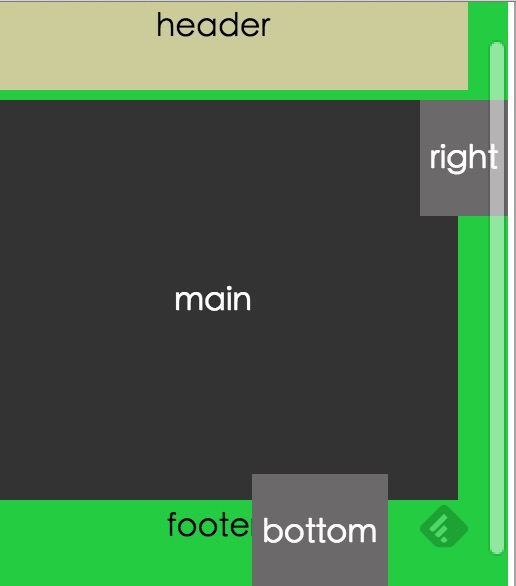

# CSS 盒模型

> 盒模型是 CSS 中最基础和最重要的概念之一，用了很久没有系统的总结过，本文将总结一下和模型的基本原理，组要注意的点，还有 CSS3 中的 box-sizing 和 弹性盒模型。

## 基本概念

页面中的每一个元素在成像上都是一个长方形，而这个长方形的宽和高又受到位置相关属性的影响(如一个块元素被浮动那么可能其在宽度上不会填充满父元素)，所以我更倾向于将定位浮动等影响位置的相关属性也算在盒模型中。在 W3C 标准浏览器下：

	元素的实际宽度 = width + padding + contentWidth + borderWidth 

高度同理。

## 需要注意的两点

### 部分 form 元素

元素的实际宽度计算方式大多数遵循标准，但是 `input:submit,reset,button` 和 `select` 的计算方式不遵循标准，对其设置 `border` 和 `padding` 时他们只会向内延伸。而且高度设置在 chrome 上无效，所以一般会通过对 `button` 来重新定义样式结合 js 实现 `input:submit,reset,button`；`select` 通过样式修饰很难做浏览器兼容，所以项目中如果需要自定义 `select` 的样式，一般自己写一个组件来替换。
 
### 最外层的盒子

最外层的盒子是 window，iframe 和 App 的网页容器(下文提到的 window 代表这三个小家伙)，这个盒子在一些渲染行为上会不同于普通元素。首先这是一个不可能被溢出的容器，其次非溢出的子元素的宽度不受溢出元素影响。先看一张图：

 	

对应 [Demo链接](/articles/css-box-model/demo/x-scroll.html)，全部的 CSS 代码：

	html {
		background: #23CC41;
	}
	body {
		margin: 0;
		text-align: center;
	}
	header {
		background: #cc9;
		line-height: 4em;
	}
	.main {
		line-height: 200px;
		margin: 5px;
		background: #333;
		color: #fff;
	}
	.main div {
		position: absolute;
		display: inline-block;
		padding: 5px;
		line-height: 3em;
		background: #6B6969;
	}
	.main .right {
		right: -20px;
	}
	.main .left {
		left: -20px;
	}
	.main .bottom {
		bottom: -20px;
	}	

关键 DOM 部分代码

	<body>
        <header>
            header
        </header>
        

            main
            
 left 

            
 right 

            <!--
 top 
-->
            
 bottom 

        

        

            footer
        

    </body>

`html` 是一个很特别的元素，当它的内部元素由于不折行或者绝对定位发生溢出时，其宽度属性对背景和超出隐藏属性表现为溢出后的宽度，但对内部的 `body` 元素的宽度表现为 window 的宽度。补充一点固定定位不会产生溢出：

	{
		position: fixed;
		right: -50px;
	}

这样定义的元素不会产生横向滚动条，上面 Demo 中的 Right 块采取绝对定位 `position: absolute;` 会使浏览器产生横向滚动条，这一点在做“回到顶部”这类页面组件动画时很有用。

`html` 的高度默认情况下不会与 window 的高度相同，也就是在高度上 `html` 不会将 window 填充满，所以在处理“版权信息”这种模块时可以这样处理：

	html {
        position: relative;
        box-sizing: border-box;
        min-height: 100%;
        padding-bottom: 30px; /* 与 footer 的高度要相同 */
    }
    .footer {
        position: absolute;
        bottom: 0;
        width: 100%;
        line-height: 30px;
    }

页面内容不满一屏时“版权信息”在最下面，页面内容超过一屏时滚动条滑到最底部显示“版权信息”，详细代码和展示参见 Demo：
[内容小于一屏](/articles/css-box-model/demo/footer.html)，
[内容大于一屏](/articles/css-box-model/demo/footer2.html)

## 伸缩盒模型

> 弹性盒模型不是一个元素一个属性，而是父子元素配合多属性协同作用才可以达到目的。规范也有多个版本，不同浏览器对不同版本的规范支持情况又不同，部分浏览器对伸缩盒模型还存在 bug，经过一番研究终于找到一条兼容的通路。IE9 还无法支持伸缩盒模型，所以我的目标是兼容 IE10+,Chrome47+,Firefox43+,Safari9+ 这四大主流浏览器的当前版本。

http://www.w3.org/Style/CSS/current-work.en.html上的截图。
还可以到地址http://meiert.com/en/indices/cssproperties/（CSS各属性查询表）查看各个CSS属性属于哪个CSS版本，以及各个属性对应的默认值，以便更清楚地知道哪些属性是在CSS基础上添加的。

https://segmentfault.com/a/1190000000707526

