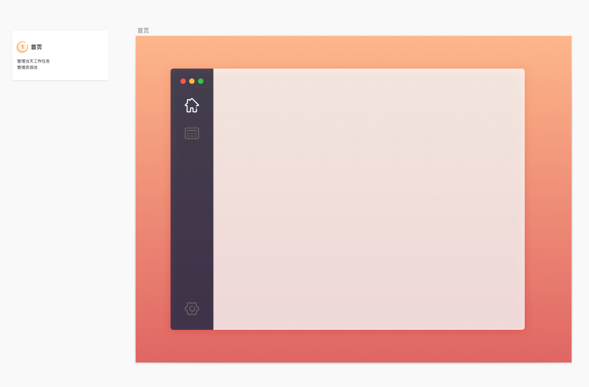
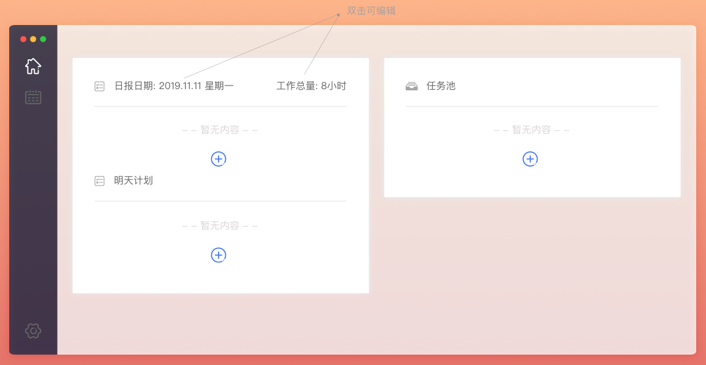
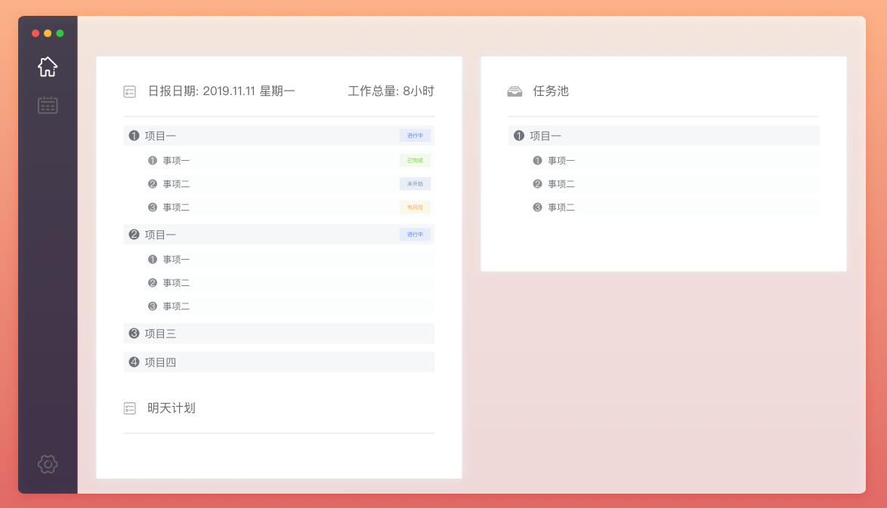
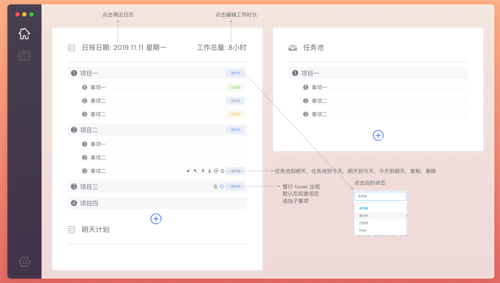
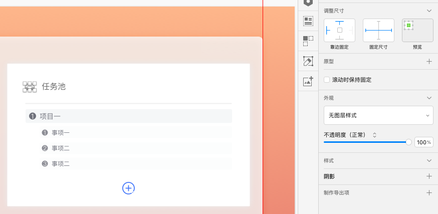
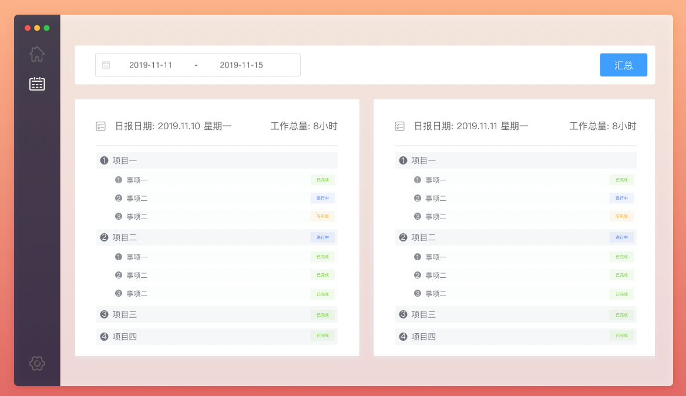
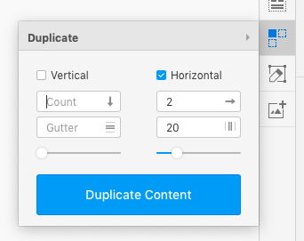
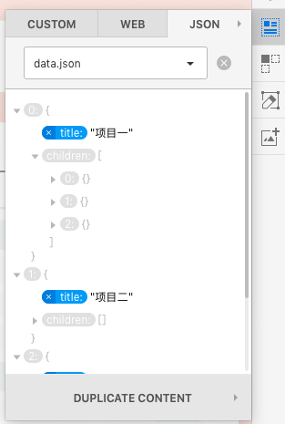
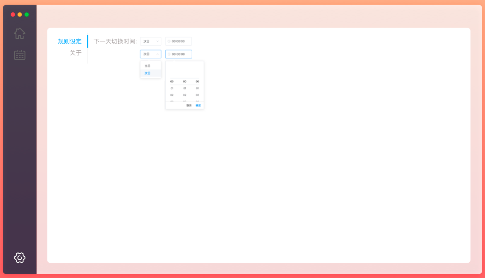
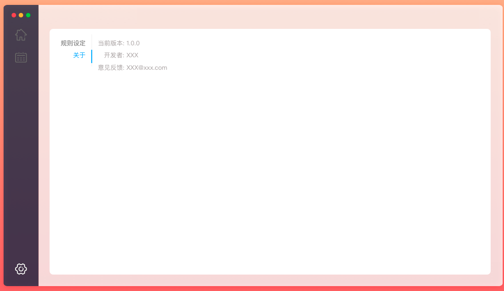

# sketch 自学笔记

> 用到什么学什么，想要独立开发一款应用，设计就少不了了。正好要开发一款桌面软件，拿来练练手。

## 概要

和 photoshop 对标为什么是 sketch? PS 可以做的很艺术，但是学习和设计比 sketch 耗时间。sketch 更适合软件设计。

本文学习的是 sketch 3。

## 安装

官网下载: http://www.sketchcn.com/

sketch 可以说是绿色版的，Mac 下载直接可用，不过我好事把它拷贝进了 Applications。

软件并不免费，试用期 30 天也基本够用了。

## 用户手册

中文: http://www.sketchcn.com/sketch-chinese-user-manual.html

英文: https://www.sketch.com/docs/getting-started/

阅读时间约 16 分钟。

摘要:

Sketch 里没有浮动面板，检查器将会根据你选中的工具来显示所需控件，这样你能始终不受打扰的在画布上创作。

如果你想在画布中设置一个固定的画框，你只需新建一个或多个新的画板。举个例子，设计移动应用界面时，很多设计师会为应用的每一个屏都创建一个画板，然后排列开来以便查看。

如果你想在画布中设置一个固定的边框，你可以直接用画板 (Artboard) 工具创造一个新的画板。

标尺，参考线，网格

## 基本概念

page，页面，这里的页面指一组页面而非单个页面，可以展现一个业务分支的全部交互逻辑。

artBoard，画板，一般可以放应用的一个或多个页面，导出 pdf 时一个画板占一页，如果要花连接图需要把页面都放在一个画板中。注意只有在画板中的元素才能导出或打印，利用这个特性在画板之外可以添加一些描述和说明类内容。

group，组，可以把元素打包成组方便管理。

## 应用类型

提供了 6 中模板，文件 / 从模板新建:
- Android Icon Design(安卓图标设计);
- iOS App Icon(苹果图标设计);
- Material Design(素材设计), 可以是图标、组件等设计元素;
- Prototyping Tutorial(原型图), 可以跨画板连线;
- Smart Layout Tutorial(智能布局)
- Web Design(网页设计), 提供 4 中设备上的布局，Desktop HD、Desktop、Table Portrait、Mobile Portrait，响应式设计。

原型图中可以定义页面之间的跳转，我们最好将"链接"和"热区"工具调处来，方法是点击"视图 / 自定义工具栏"，然后把想要的工具拖到工具栏。

选中画板中的某个元素，点击工具栏上的"链接"，就可以指定跳转到哪一个画板了。然后就可以点击“预览”来查看跳转逻辑了，页面之间的转场动画也是可以设置的，在“原型 / 动画”中设置。

## 插件

### 插件管理器 - Sketch Toolbox

[Sketch Toolbox](http://sketchtoolbox.com/)，可以直接搜索安装插件。我用的时候经常奔溃，好在不常用忍了。

### 导出插件 - Sketch Measure

虽然有 Sketch Cloud 云，但是它是收费的。要队友没有 Sketch ，那只能导出 png 图片或 pdf 文件给他看，有一个好用的插件 - [Sketch Measure](http://utom.design/measure/)。Sketch 插件的安装也是比较随性，直接从官网下载压缩包解压，然后点击 .sketchplugin 文件秒装。使用方式: 插件 / Sketch Measure / 导出规范，选着要导出的页面就可以了。

### 图标插件 - Icon Font

[Icon Font](https://github.com/keremciu/sketch-iconfont)，图标插件。可以导入 svg 图标，自定义图标。

### 内容填充 - Craft

[Craft](https://www.invisionapp.com/craft)，可以直接从网站上扒图扒文字，填充到设计中。这个插件安装的时候略麻烦，需要先安装官方给的应用，安装后运行起来，再在系统的 menu bar 上找到它的图标，选择 Sketch 类型插件安装，最后你才能在插件中看到它。

很多好看的图片可以直接使用。

### 更多

更多工具推荐: https://cloud.tencent.com/developer/news/311543

在官方备过案的插件集合: https://www.sketch.com/extensions/plugins/

## 软技能

工具装好了，还掌握了这么多理论知识，你可能依然不会设计。首先你可以看看别人的设计作品，中文官网提供了很多，从这里传送: https://www.oursketch.com/resource?category=ui

然后再看几个设计视屏: https://www.oursketch.com/video ,看看别人是怎么用工具的。

最后找一个或多个和你目标最接近的项目来仿着做。正好我要设计一个给自己用的工具，一步步来讲怎么实现:

## 产品定义

### 背景

公司要求写日报，周末还要写周报，月底还要总结，季末还要做目标回顾。自我管理也是很重要的个人能力，每天有多少时间是在编码或学习，又有多少时间是在闲逛各种网站和 App，我想有一个工具可以很方便的记录工作内容，记录每项任务上画的时间，不是敷衍的给老板看，而是通过工具来提高自己的专注力和工作效率，让我有更多的主动有意识的休闲和学习时间。所以我需要这样一个工具。

考虑到数据的敏感性和应用场景，打算采用桌面应用的形式来实现。

### 目标

- 1、提高写日报的效率
- 2、自动生成 周报、月报、季报
- 3、内容备注，有一些不想体现在日报中的辅助信息
- 4、自动调整和生成序号
- 5、记录每项任务的时间
- 6、支持项目维度汇总，支持工作专注时间汇总
- 7、本地存储，支持 markdown 形式导出，避免接触敏感数据

## 通用设计

### 选择素材

这里有很多设计图可供参考: https://www.oursketch.com/resource

喜欢简洁科技风，曾经和一个谷歌的设计大神合作过，他传我两条准则: 
- 少数颜色和间距搭配;
- 对齐和居中搭配。

根据这个两原则去设计，最后我会贴出用到的颜色和间距。

喜欢这个风格的导航: https://www.oursketch.com/resource/1915

这几个设计的一些元素可以借鉴: 
- https://www.oursketch.com/resource/563
- https://www.oursketch.com/resource/1884
- https://www.oursketch.com/resource/951

### 新建

文件 / 从模板新建 / Prototyping Tutorial

删除其他界面，只留下第一个界面的说明和面板。

### 背景和框架

设计步骤:
- 设计桌面应用为了表现半透明磨砂效果，设置一个渐变背景
- 再拖一个应用软件框进来，长宽 1300 * 960，取消背景填充
- 左边画矩形，背景色 `#26304C`，80% 的半透明
- 从素材中引入苹果的操作按钮，调整间距，调整导航背景宽度
- 右侧画矩形，填充剩余部分，白色背景，透明度也 80%

技巧:
- 把上面的元素全部选中，右击，创建为组件，以后用的时候一拖就进来了，要改的时候选择 Symbols 找到组件，一概全改
- 选中设计元素，按着 options 可以查看它和其他元素的间距
- 感性审美比较差的可以理性一点，间距相等，横平竖直的对齐，一般也不会太难看

### 导航

导航想采用图标，首页，设置页，归档页。

从 iconfont 上找了一套字体: https://www.iconfont.cn/collections/detail?spm=a313x.7781069.0.da5a778a4&cid=2747

然后从其中选出需要的图标: home, calendar, setting。

设计步骤:
- 图标拖入，调整图标大小和颜色

技巧:
- 用于导航的图标要选择细线或中线，粗线图标显得笨拙(傻大黑粗)
- 下载某个图标时可以查看它所属的系列，这样就可以找到一组设计风格类似的图标，避免了一个个寻找的麻烦
- 导航统一，某个图标高亮却不容易设置，可以都设置为置灰，然后在某一页用一个高亮图标覆盖当前页图标
- 四角设置不同的圆角值时是这种格式: 0;5;10;15，很多文章将的都是前面的版本 0/5/10/15 是不对的

首页原比例:

## 业务界面设计 - 首页

首页分日报和任务池两个功能部分。

设计步骤:
- 软件冷启动时的暂无内容

- 内容展现态

- 各种激活态，为了方便截图采用了 hover 激活，在当前界面上编辑，无需跳转

技巧: 

- 一个内容块要调整大小，如果里面的元素可以随着响应会省不少事，比如标题的间隔随着缩放或者图标在左上角不动。这可可以通过设置"调整尺寸"来实现，两边点亮就会随着容器缩放，一边点亮就位置不动，如果什么都不设置会随容器缩放，一般会变形。

- 当可复用的组件很多时可以通过名称来编组，这样插入时就可以通过层级的形式来查找

## 业务界面设计 - 归档页

弹层提供汇总功能，供周报和月报使用

技巧:

- 当你要有多个内容单元需要展现时，复制再调间距肯定是一个低效的方式，用 Craft 的 Duplicate 功能可以快速复制组件，并且支持横向和纵向好友间距统一调整。复制后的内容单元是彼此独立的，修改其中一个不影响其他的，如果想一个改变全部改变，可以在复制之前通过组件来实现。

- 如果你想文字不一样，还可以导入一个 json

## 业务界面设计 - 设置页

- 配置界面，做符合用户习惯的自定义配置

- 关于，做好事要留名，方便意见反馈(被喷)

## 附录

- 少数颜色和间距搭配;
- 对齐和居中搭配。

颜色: 
- 26304C(80%透明度) 导航背景色。
- fff 导航图标高亮色，深色按钮文字色；+80% 透明度成为内容区背景色。
- 666 图标标准色(深底反白和白底展示内容都用这个色，高级)，一级标题色。
- 70727C 内容标准色。
- D5D5D5 装饰文字色(暂无内容等)。
- 409EFF 按钮底色，图标高亮色。(从 element-ui 上扒的颜色)
- EAEEF0 内容区块分隔底色，50% 透明底一级分隔，10% 透明度二级分隔。
- EFEFEF 分割线颜色。

封装了一组 tag，tag 的颜色也很有趣，文字的颜色加 8% 的透明度设置就是背景色，下面是文字色:
- 778CA2: 未开始
- 6DD230: 已完成
- FE4D97: Delay
- FFAB2B: 有风险
- 4D7CFE: 进行中

间距:
- 6  圆角，Mac IOS 的标准。
- 25 导航图标宽高，导航图标的上下间距，导航图标距左右边距，这直接决定了导航条宽度，”最大、最小、关闭“三个按钮居中，上间距等于左右间距。
- 13 文字和图标间距，文字和间隔线间距。
- 7  小间距。
- 16 三级字号第一级。
- 14 三级字号第二级。
- 12 三级字号第三级。
